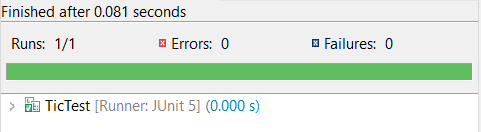

# Lab 04
| Outline | Value |
| --- | --- |
| Course | SEG 3X03 |
| Date | Summer 2021 |
| Professor | Andrew Forward, aforward@uottawa.ca |
| TA | Nazanin Bayati Chaleshtari, n.bayati@uottawa.ca|
| Team | Fatimah Vakily 300125671 |

### Java
I am running Java 14.0.1

### Failing Test

I first created a test case that would fail.

The code within the tic_java.java file I was testing:

The code calling the test:

The result:

### Passing Test

I then changed the code within tic_java.java to the following:

The result was a passing test.

### Refactoring

In the inital commit, every time I tested the placement of an X to the board, it would wipe all other values from the board, so I restructured it to prevent that from happening.

I then changed the code to allow specification of board size instead of just using a default size, and then refactored it to catch if there were logical issues with specification of board size.
