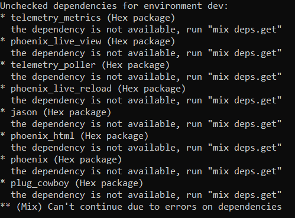
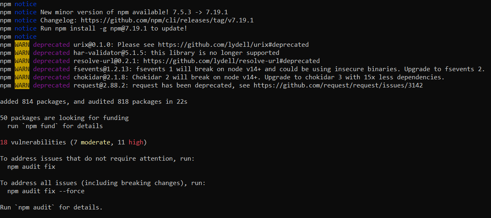
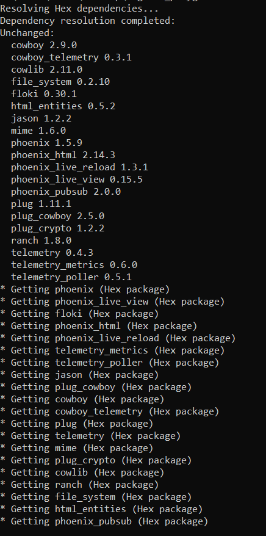
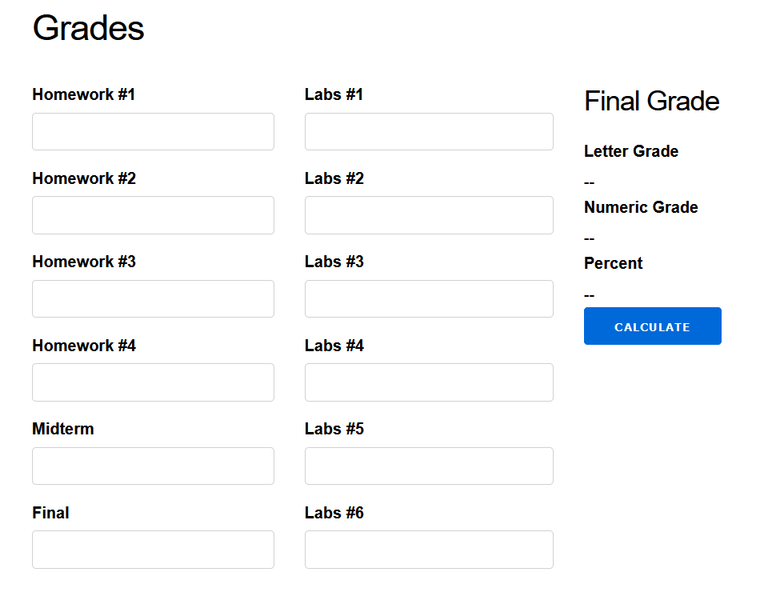
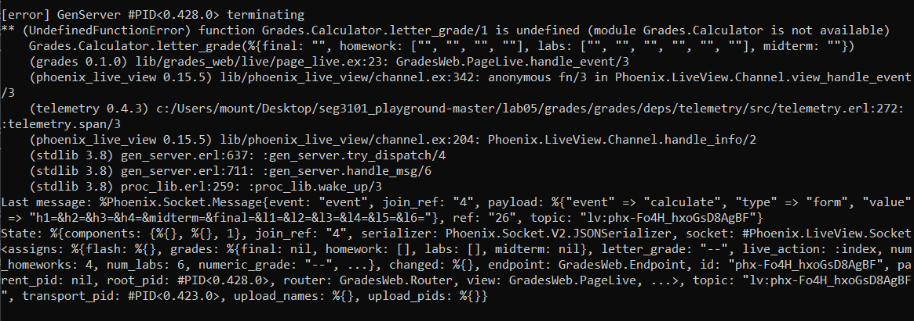
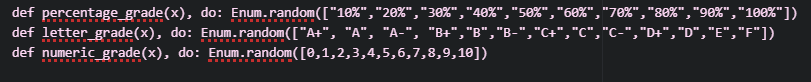
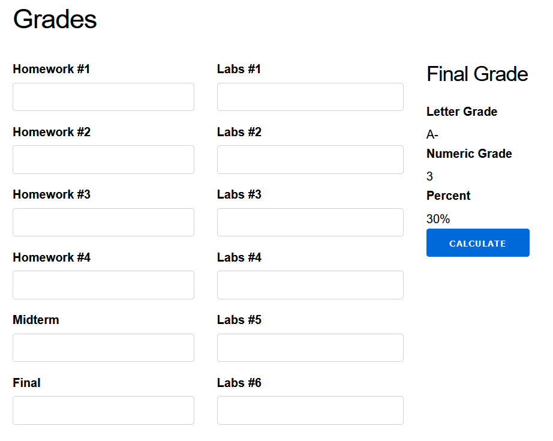
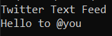

# Lab 05
| Outline | Value |
| --- | --- |
| Course | SEG 3X03 |
| Date | Summer 2021 |
| Professor | Andrew Forward, aforward@uottawa.ca |
| TA | Henry Chen, zchen229@uottawa.ca|
| Team | Fatimah Vakily 300125671 |

### Elixir
I am running Elixir 1.11.4 with Erlang 21

### Grades
I first tried to compile using the following command

```
mix compile
```

This gave me the following errors:




I also used:

```
cd assets && npm install
```
Which gave me this result:




To fix the earlier errors that arose when I tried to use "mix compile", I used:
```
mix deps.get
```
This was then displayed in the cmd:




Now I tried using
```
mix phx.server
```

And then went to http://localhost:4000 and it displayed this:



But gave this result when the "Calculate" button was pressed:




I stubbed the code to display random values:





Then I added the assignment 2 calculator code that was made by myself and my assignment partner.

Observations: The code provided for the lab does not work with the assignment 2 solution that the instructions asked us to use, so I am unable to compare the stubbed code to the version with actual code. The stubbed code was very fast to provide results and allowed me to get a solid understanding of how the website should function with working code that provides full functionality.


### Java

I am running Java 14.0.1

### JUnit

I am working with JUnit 5 (via Console standalone 1.7.1)

### Twitter
To run the Twitter program, first I compiled it:

```bash
javac -encoding UTF-8 --source-path src -d dist src/*.java
```

Then I ran it with the following command:

```bash
java -cp ./dist Main
```
With a screenshot from the terminal




To run JUnit, I then compiled the test code

```bash
javac -encoding UTF-8 --source-path test -d dist -cp lib/junit-platform-console-standalone-1.7.1.jar test/*.java src/*.java
```

Then I ran the tests using the following command:

```
java -jar lib/junit-platform-console-standalone-1.7.1.jar --class-path dist --scan-class-path
```
