# Lab 06
| Outline | Value |
| --- | --- |
| Course | SEG 3X03 |
| Date | Summer 2021 |
| Professor | Andrew Forward, aforward@uottawa.ca |
| TA | Zahra Kakavand, zkaka044@uottawa.ca|
| Team | Fatimah Vakily 300125671 |

### MVN
I first downloaded Apache Maven and added its bin folder as my system's PATH  environment variable.
I am running apache maven version 3.8.1

```bash
mvn --version
Apache Maven 3.8.1 (05c21c65bdfed0f71a2f2ada8b84da59348c4c5d)
Maven home: C:\Users\mount\Desktop\seg3101_playground-master\lab06\BookstoreApp\BookstoreApp\apache-maven-3.8.1-bin\apache-maven-3.8.1\bin\..
Java version: 14.0.1, vendor: Oracle Corporation, runtime: C:\Program Files (x86)\jdk-14.0.1_windows-x64_bin\jdk-14.0.1
Default locale: en_CA, platform encoding: Cp1252
OS name: "windows 10", version: "10.0", arch: "amd64", family: "windows"
```

Here is a screenshot:

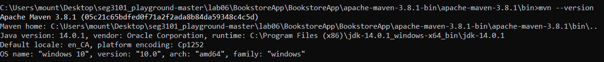


After that, I compiled using
```bash
mvn compile
```
and it compiled successfully.

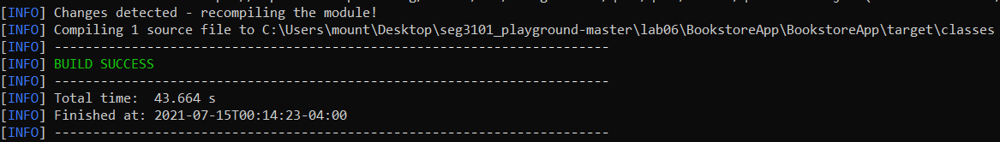

Then I ran the following command:
```bash
mvn package -DskipTests
```
which is a command that packages all the project files into one jar file so it can easily be run. It completed successfully.

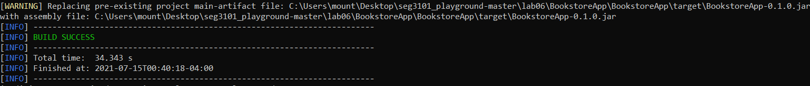


### BookstoreApp

First I tried using

```bash
java -jar ./target/BookstoreApp-0.1.0.jar
```
as instructed in the lab slides, but when I went to http://localhost:8080 it did not work and said it was unable to connect.

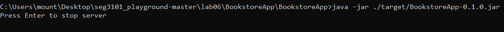
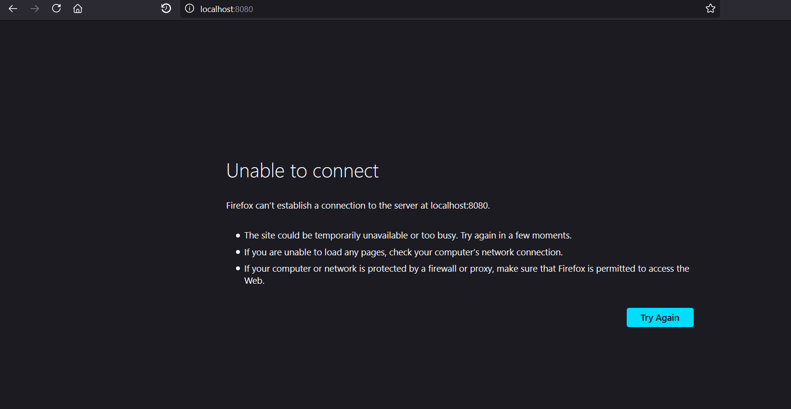


Afterwards, I tried to use this command:

```bash
java -jar bookstore5.jar
```

and then went to http://localhost:8080 and it worked successfully.

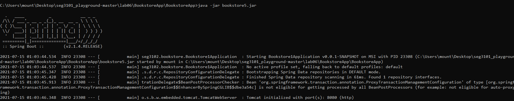
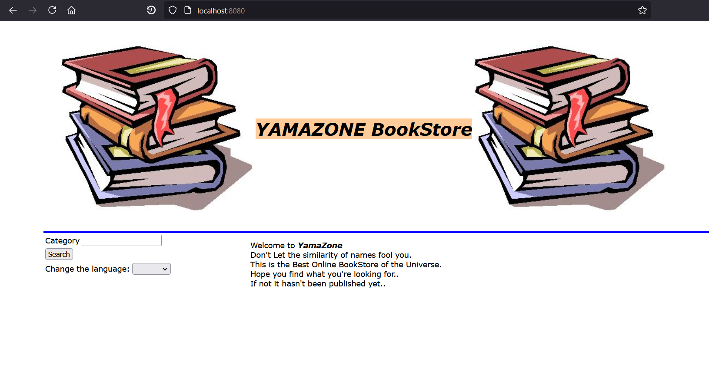


I went to http://localhost:8080/login and logged in with username "admin" and password "password" to reach http://localhost:8080/admin

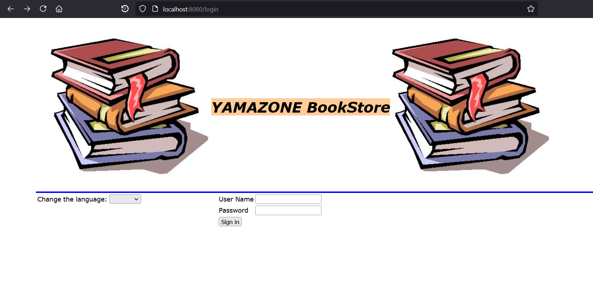
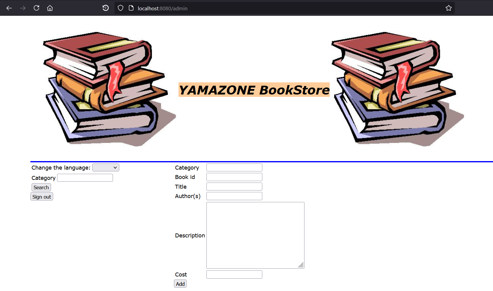


### MVN Test

I used another command prompt window and used the command
```bash
mvn test
```
to run the tests.

This method allowed them to be run, and they all passed.

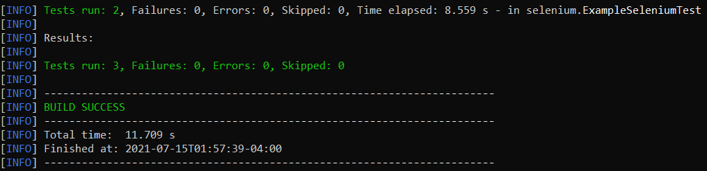


I then added my own test to the ExampleSeleniumTest.java file and ran mvn test again, and all tests passed once again.

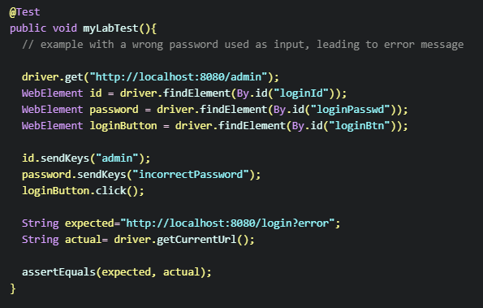
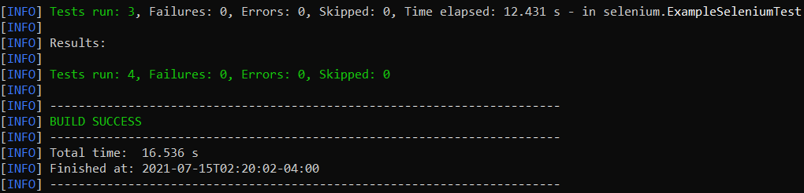
