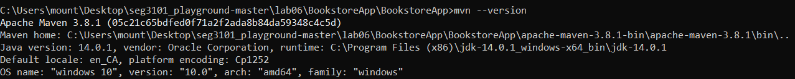

# Lab 06
| Outline | Value |
| --- | --- |
| Course | SEG 3X03 |
| Date | Summer 2021 |
| Professor | Andrew Forward, aforward@uottawa.ca |
| TA | Zahra Kakavand, zkaka044@uottawa.ca|
| Team | Fatimah Vakily 300125671 |

### MVN

I am running apache maven version 3.8.1

```bash
mvn --version
Apache Maven 3.8.1 (05c21c65bdfed0f71a2f2ada8b84da59348c4c5d)
Maven home: C:\Users\mount\Desktop\seg3101_playground-master\lab06\BookstoreApp\BookstoreApp\apache-maven-3.8.1-bin\apache-maven-3.8.1\bin\..
Java version: 14.0.1, vendor: Oracle Corporation, runtime: C:\Program Files (x86)\jdk-14.0.1_windows-x64_bin\jdk-14.0.1
Default locale: en_CA, platform encoding: Cp1252
OS name: "windows 10", version: "10.0", arch: "amd64", family: "windows"
```

Here is a screenshot:


