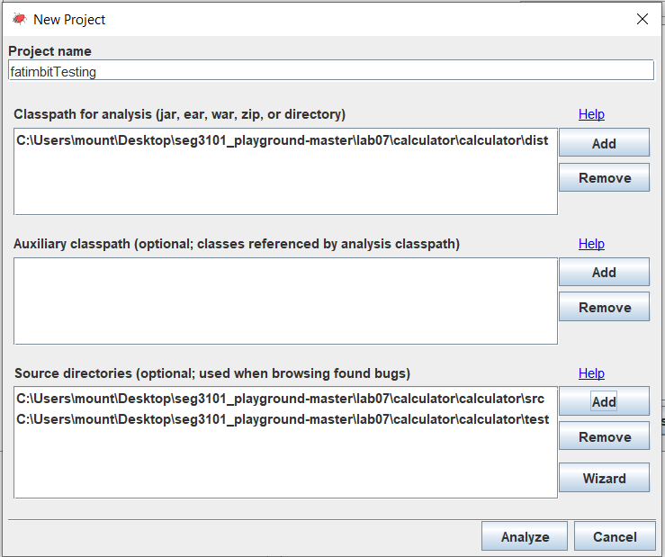
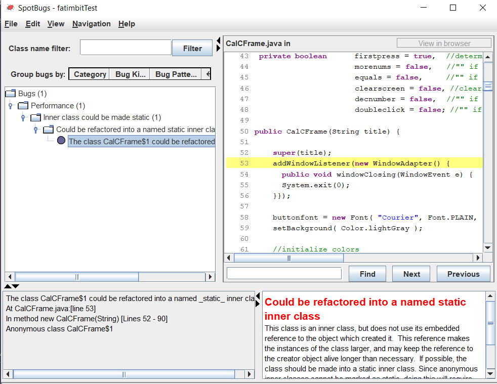

# Lab 07
| Outline | Value |
| --- | --- |
| Course | SEG 3X03 |
| Date | Summer 2021 |
| Professor | Andrew Forward, aforward@uottawa.ca |
| TA | Henry Chen, zchen229@uottawa.ca|
| Team | Fatimah Vakily 300125671 |

I compiled the code with this command:

```bash
javac -encoding UTF-8 --source-path test -d dist -cp lib/junit-platform-console-standalone-1.7.1.jar test/*.java src/*.java
```
Then ran it:
```bash
java -cp ./dist Main
```

Here is a screenshot of the result.


After that, I used this command to run spotbugs:

```bash
java -jar ./lib/spotbugs/lib/spotbugs.jar
```
Here is a screenshot of the spotbugs screen:


I then created a new project:



This is the result of the analysis showing how many bugs the code had at first:


I then fixed the bugs until I got this as the result of the spotbugs analysis:



The only bug I did not fix was the one showing the "Bug kind and pattern: SIC - SIC_INNER_SHOULD_BE_STATIC_ANON" message. I would fix the code by refactoring the inner class on line 53 of the CalCFrameTest.java file into a static named inner class.